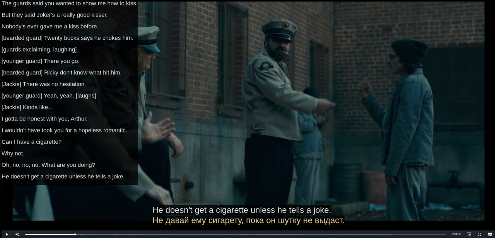
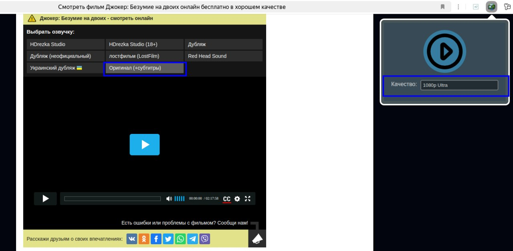

Браузерное расширение для браузеров на основе chrome, позволяющее просматривать фильмы и сериалы с https://hdrezka.tv и его зеркал. Получить актуальное зеркало: https://vk.com/@hdrezka-kak-naiti
Расширение позволяет смотреть фильмы и сериалы с субтитрами на двух языках одновременно.

Расширение создано в личных целях для изучания английского языка в качестве альтернативы PuzzleMovies.

### Установка

1. Загрузите архив и распакуйте его в удобное для вас место.
2. Откройте страницу с расширениями (chrome://extensions/) вашего браузера и активируйте там "Режим разработчика" (Обычно переключатель находится в правом верхнем углу)
3. Нажмите кнопку "Загрузить распакованное расширение" и выберите папку с распакованным расширением.
   
### Использование

1. Выберите фильм или сериал, который вы хотите посмотреть.
2. Выберите на сайте версию фильма в оригинальной озвучке с субтитрами.
3. Нажмите на иконку расширения, выберите качество видео, нажмите на кнопку "play" (круглая с треугольником).

Видео откроется в новой вкладке.

При наведении курсора на поле с субтитрами, видео остановится, при уводе курсора с поля с субтитрами, видео продолжит воспроизведение.

При остановке видео слева отображается список последних фраз. При нажатии на одну из предыдущих фраз, видео воспроизведется с этой фразы.

При нажатии на клавишу "стрелка влево" или "стрелка вправо", можно переключиться между субтитрами.

При нажатии на клавишу "пробел", воспроизведение может быть остановлено или возобновлено.

Изменить размер шрифта можно изменяя масштаб страницы - при нажатой клавише Ctrl прокрутите колесо мыши, или Ctrl + Плюс / Ctrl + Минус (⌘ + Плюс / ⌘ + Минус).

Текст в поле с субтитрами можно перевести, используя ваше любимое расширение для перевода.

